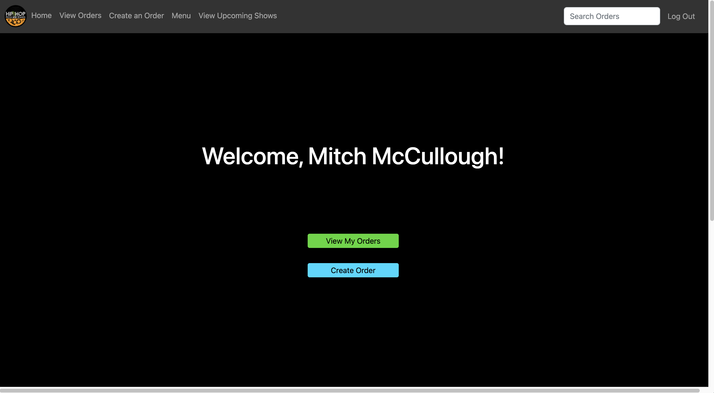
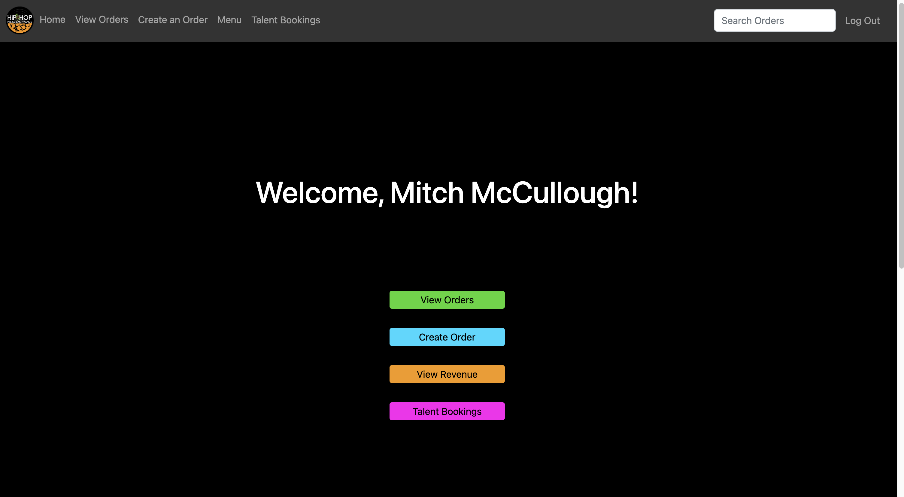
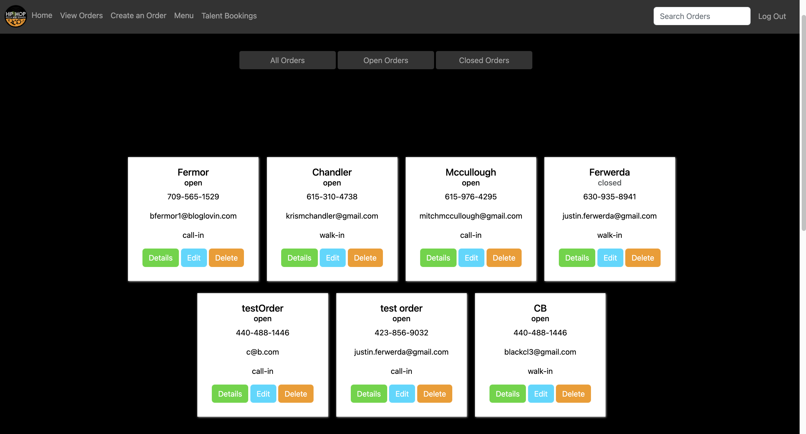
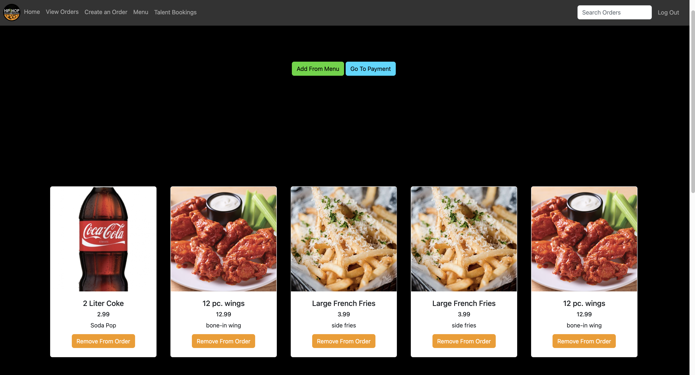
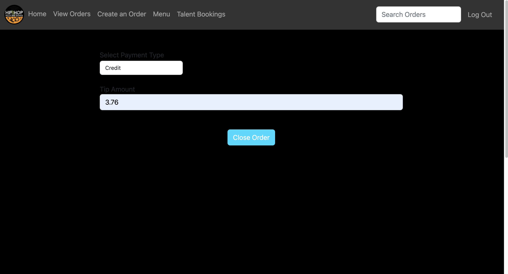
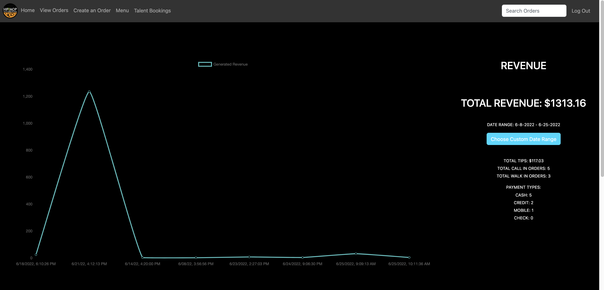
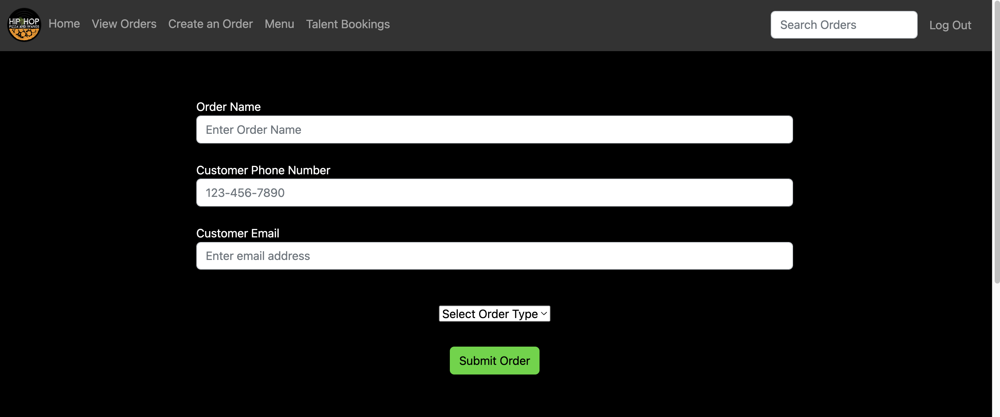
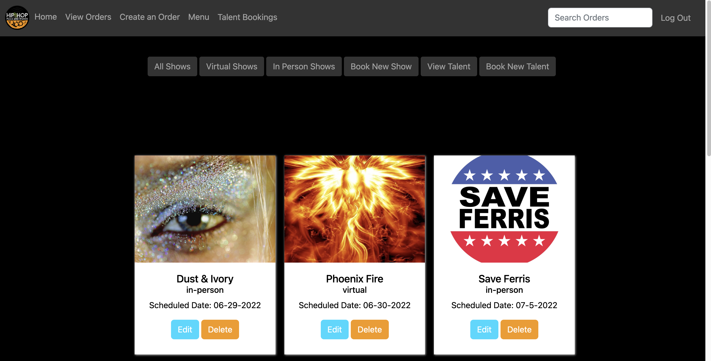

<h1>POS Power</h1>

<image src="./instructions/hhpw-record.png" style="height:300px;"></image>

## Overview

Planning Documents for Project:

* **[ERD](https://dbdiagram.io/d/62a7c7409921fe2a96f9b983)** - Create an ERD to show the relationships between all of  your data
* **[Postman Collection](https://go.postman.co/workspace/POS-POWER~f2be894b-e001-4cab-a02a-7ea1eefd26a1/collection/20353056-902a4d8f-c9aa-4626-895e-f6093c3a44fd?action=share&creator=21027593)**
* **[Wireframes](https://www.figma.com/file/4y3EZddALuBR3ouSEM57Np/MVP?node-id=0%3A1)** - This is the basic MVP wireframe. (View the [click through prototype](https://www.figma.com/proto/4y3EZddALuBR3ouSEM57Np/MVP?scaling=scale-down&page-id=0%3A1&starting-point-node-id=2%3A2) if you want to see the flow)
* **[Flowchart](https://www.figma.com/file/RmegeX2jpdgU0Z1bQk7xRh/Wings%2FPizza-Flowchart?node-id=0%3A1)** - Plan out the flow of your data through the application
* **[Github Issue Tickets](https://github.com/nss-evening-cohort-19/pos-system-pos-power/issues)** - Using the Project Instructions as a guide, create issue tickets for this project’s work.
* **[Github Milestones](https://github.com/nss-evening-cohort-19/pos-system-pos-power/milestones)** - Separate those issue tickets into Milestones to plan out the work.
* **[Github Project Board](https://github.com/nss-evening-cohort-19/pos-system-pos-power/projects/1)** - Create a project board, add all of your issue tickets, and order them by priority.

## Definition of Project

Introducing the new POS (Point of Sale) system for Hip Hop Pizza N' Wings!

This state of the art system:
  
  - Requires login for all users through Google Authentication.

  - Has different interfaces for Admins (HHPnW employees) & customers!

      <table>
        <tr>
          <td>User Home Page</td>
          <td>Admin Home Page</td>
        </tr>
        <tr>
          <td></td>
          <td></td>
        </tr>
      </table>

  - Is composed of:

      1. A Home Page with links to the View Orders Page, Create Orders Page, View Revenue Page (Admin), Book Talent Page (Admin).
      
      <table>
        <tr>
          <td>Admin Home Page</td>
        </tr>
        <tr>
          <td></td>
        </tr>
      </table>

      2. A Nav Bar with links to the Home Page, View Orders Page, Create Order Page, Menu Page, Talent Booking Page (View Upcoming Shows for Customers).

      <table>
        <tr>
          <td>Nav Bar</td>
        </tr>
        <tr>
          <td></td>
        </tr>
      </table>

      3. A View Orders Page with the ability to filter on All Orders, Open Orders and Closed Orders.
          - Users can see Order Details (Order Detail Page) for each order, edit each order and delete each order.

      <table>
        <tr>
          <td>Orders Page</td>
        </tr>
        <tr>
          <td></td>
        </tr>
      </table>

      4. An Order Details Page with the ability to add items from a specified menu (specified by Admin) to order, remove items from an order and Close order (go to payment - Close Order Page)

      <table>
        <tr>
          <td>Order Details Page</td>
        </tr>
        <tr>
          <td></td>
        </tr>
      </table>

      5. A Close Order Page with the ability to specify payment type (cash, credit, check, mobile) and tip amount.

      <table>
        <tr>
          <td>Close Order Page</td>
        </tr>
        <tr>
          <td></td>
        </tr>
      </table>

      6. A Revenue Page (Admin) that lets the Admin know the total Revenue, Tip Amounts, Call-in Order Amounts, Walk-in Order Amounts, Respective Payment Type Amounts for a specified date range (and renders results into a chart).

      <table>
        <tr>
          <td>Revenue Page</td>
        </tr>
        <tr>
          <td></td>
        </tr>
      </table>

      7. A Create Order Page that lets user input Order Name, Cust. Phone Number and Customer Email for Order.

      <table>
        <tr>
          <td>Create Order Page</td>
        </tr>
        <tr>
          <td></td>
        </tr>
      </table>

      8. A Book Talent Page (Admin) that filters on all Shows and Talent Acts and lets Admin book new Shows/Talent. (note: non-Admin users are available to view this page without making edits.)

      <table>
        <tr>
          <td>Book Talent Page</td>
        </tr>
        <tr>
          <td></td>
        </tr>
      </table>

      9. A Menu Page that lets Admins add new items to the menu!

### Instructions

* [MVP Definition - It Gets the Job Done](./instructions/mvp.md)
* [Stretch Goals 1 - Filtering the Data](./instructions/stretch-1.md)
* [Stretch Goals 2 - Dealing with Change](./instructions/stretch-2.md)
* [Stretch Goals 3 - Play that Funky Music](./instructions/stretch-3.md)
